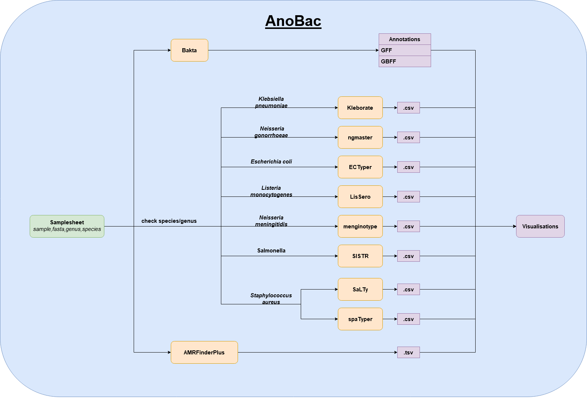

[](https://www.nextflow.io/)
[](https://docs.conda.io/en/latest/)
[](https://www.docker.com/)
[](https://sylabs.io/docs/)
[](https://tower.nf/launch?pipeline=https://github.com/anno/annorki)

# AnoBac

## Introduction

**AnoBac** is a bioinformatics pipeline to annotate and type a variety of bacterial pathogens. This includes generic modules for the annotation as well as AMR/virulence assessment which can run for any given bacterial genome. For certain public-health relevant species (or genera such as *Salmonella*) additional typing modules are executed. Species information can be used to improve annotation and AMR prediction if supported by the incorporated tools.


<!-- TODO nf-core:
   Complete this sentence with a 2-3 sentence summary of what types of data the pipeline ingests, a brief overview of the
   major pipeline sections and the types of output it produces. You're giving an overview to someone new
   to nf-core here, in 15-20 seconds. For an example, see https://github.com/nf-core/rnaseq/blob/master/README.md#introduction
-->

<!-- TODO nf-core: Include a figure that guides the user through the major workflow steps. Many nf-core
     workflows use the "tube map" design for that. See https://nf-co.re/docs/contributing/design_guidelines#examples for examples.   -->
<!-- TODO nf-core: Fill in short bullet-pointed list of the default steps in the pipeline -->

## General Workflow
1. Annotation - [Bakta](https://github.com/oschwengers/bakta)
2. Typing
   1. [Kleborate](https://github.com/klebgenomics/Kleborate) → for *Klebsiella pneumoniae* species complex (KpSC)
   2. [SISTR](https://github.com/phac-nml/sistr_cmd) → for *Salmonella*
   3. [meningotype](https://github.com/MDU-PHL/meningotype) → for *Neisseria meningitides*
   4. [LisSero](https://github.com/MDU-PHL/lissero) → for *Listeria monocytogenes*
   5. [ngmaster](https://github.com/MDU-PHL/ngmaster) → for *Neisseria gonorrhoeae*
   6. [ECTyper](https://github.com/phac-nml/ecoli_serotyping) → for *Escherichia coli*
   7. [SaLTy](https://github.com/LanLab/salty) & [spaTyper](https://github.com/HCGB-IGTP/spaTyper) → for *Staphylococcus aureus*
3. AMR & Virulence prediction - [AMRFinderPlus](https://github.com/ncbi/amr)

<p align="center"><picture></picture></p>


## Usage

> **Note**
> If you are new to Nextflow and nf-core, please refer to [this page](https://nf-co.re/docs/usage/installation) on how
> to set-up Nextflow. Make sure to [test your setup](https://nf-co.re/docs/usage/introduction#how-to-run-a-pipeline)
> with `-profile test` before running the workflow on actual data. (NOT SETUP YET...)


Now, you can install the pipeline using:

```bash
# get the most recent pipeline version (the same command updates the pipeline)
nextflow pull rki-mf1/anobac
# check the available release versions and development branches
nextflow info rki-mf1/anobac
# select a recent release and run
nextflow run rki-mf1/anobac -r v0.1 -profile <singularity, docker, conda, mamba> -params-file params.yaml
```

Another option is to clone the repository and run the pipeline but we recommend using the `nextflow pull` option and stable release versions via `-r`.

> **Warning:**
> Please provide pipeline parameters via the CLI or Nextflow `-params-file` option. Custom config files including those
> provided by the `-c` Nextflow option can be used to provide any configuration _**except for parameters**_;
> see [docs](https://nf-co.re/usage/configuration#custom-configuration-files).


The pipeline needs a few input parameters to be defined. This can be done either directly in the command line, or via a parameter file (params.yaml as in the command above). Using a params file is advised. Here is a minimum example of a params file with the required parameters:

`params.yaml`:
```
input: '/path/to/input/samplesheet.csv'
outdir: '/path/to/output_directory'
bakta_db: '/path/to/bakta_database'
amrfinder_db: '/path/to/amrfinderplus_database'
```

The additional flags in the command e.g. "-profile" will define how the pipeline is executed e.g. singularity, conda, mamba or docker (we recommend using singularity, if available).
When executing the pipeline on a HPC with a queuing system you might want to limit the amount of jobs submitted in parallel you can use the option "-queue-size 20" to limit the jobs submitted to the queue to 20 in the nextflow command above.

## Inputs:
### Parameters and Filter Options

| name |  required (to set by user) |  description | type in config  | default value |
|---|---|---|---|---|
| input | YES | path to input samplesheet in csv format (more detailed explanation below) | string | null |
| outdir | YES | path to output directory | string | null |
| bakta_db | YES | path to predownloaded Bakta database to use for annotation | string | null |
| amrfinder_db | YES | path to predownloaded AMRFinderPlus database | string | null |
| ngmaster_db | NO | path to predownloaded ngmaster database | string | [] |
| setup_dbs | NO | set to true to only download Bakta and AMRFinderPlus databases (no analysis is performed) | boolean | false |
| tmp_dir | NO | path to temp directory (used for some processes) | string | /tmp/ |
| publish_dir_mode | NO |---| string | 'copy' |

### Detailed walkthrough

#### Database setup
To run AnoBac, a local copy of the Bakta and AMRFinderPlus databases are required. The setup of these can be directly performed within AnoBac by setting the **setup_dbs** parameter to 'true' and running AnoBac. In this case, only the databases will be downloaded and no further analyses are perfomed. Since the Bakta database is quite large (and takes long to download), this is kept as a separate process from the analysis to avoid redownloading. Ideally this process is therefore run as a one-time setup and the databases can be reused later on.


**NOTE** since (currently) the other inputs (input, output, bakta_db, amrfinder_db) are mandatory, they require to specify a value even if no analysis is performed. While the parameters 'bakta_db' and 'amrfinder_db' can be filled with random placeholders, the input samplesheet requires to be a file that exists (even though the content does not matter for the database download).

Here is a minimum example of a params file with the required parameters to download the databases:

`params.yaml`:
```
input: '/path/to/input/samplesheet.csv'
outdir: '/path/to/output_directory'
bakta_db: 'test'
amrfinder_db: 'test'
```

#### Input samplesheet
After database setup, prepare a samplesheet with your **input** data that looks as follows, with each row representing a sample via a genome assembly:
`samplesheet.csv`:
```
sample,fasta,genus,species
S1,/path/to/S1.fasta,Escherichia,coli
S2,/path/to/S2.fasta,Acinetobacter,baumannii
S3,/path/to/S2.fasta,Klebsiella,pneumoniae
S4,/path/to/S2.fasta,Neisseria,meningitidis
S5,/path/to/S2.fasta,Listeria,monocytogenes
S6,/path/to/S2.fasta,Neisseria,gonorrhoeae
S7,/path/to/S2.fasta,Salmonella,enterica
S8,/path/to/S2.fasta,Salmonella,
S9,/path/to/S2.fasta,,
...
```
Genus and species information are optional and can be omitted if unknown. But it its recommended to include it if available, as the execution of specific typing tools are dependend on it (as shown in the workflow visualization). Additonally, genus and species information can be used to improve annotation as well as AMR prediction if the species is supported by the incorporated tools.


## Credits

AnoBac was originally written by Maximilian Driller.

We thank the following people for their extensive assistance in the development of this pipeline:

Vladimir Bajić, Silver A. Wolf, Torsten Houwaart, Lakshmipriya Thrukonda and Mustafa Helal

<!-- TODO nf-core: If applicable, make list of people who have also contributed -->

## Contributions and Support

If you would like to contribute to this pipeline, please see the [contributing guidelines](.github/CONTRIBUTING.md).

## Citations

<!-- TODO nf-core: Add citation for pipeline after first release. Uncomment lines below and update Zenodo doi and badge at the top of this file. -->
<!-- If you use  anno/annorki for your analysis, please cite it using the following doi: [10.5281/zenodo.XXXXXX](https://doi.org/10.5281/zenodo.XXXXXX) -->

<!-- TODO nf-core: Add bibliography of tools and data used in your pipeline -->

An extensive list of references for the tools used by the pipeline can be found in the [`CITATIONS.md`](CITATIONS.md) file.

This pipeline uses code and infrastructure developed and maintained by the [nf-core](https://nf-co.re) community, reused here under the [MIT license](https://github.com/nf-core/tools/blob/master/LICENSE).

> **The nf-core framework for community-curated bioinformatics pipelines.**
>
> Philip Ewels, Alexander Peltzer, Sven Fillinger, Harshil Patel, Johannes Alneberg, Andreas Wilm, Maxime Ulysse Garcia, Paolo Di Tommaso & Sven Nahnsen.
>
> _Nat Biotechnol._ 2020 Feb 13. doi: [10.1038/s41587-020-0439-x](https://dx.doi.org/10.1038/s41587-020-0439-x).
>
> Schwengers O., Jelonek L., Dieckmann M. A., Beyvers S., Blom J., Goesmann A. (2021). Bakta: rapid and standardized annotation of bacterial genomes via alignment-free sequence identification. Microbial Genomics, 7(11). https://doi.org/10.1099/mgen.0.000685
>
> Feldgarden M, Brover V, Gonzalez-Escalona N, Frye JG, Haendiges J, Haft DH, Hoffmann M, Pettengill JB, Prasad AB, Tillman GE, Tyson GH, Klimke W. AMRFinderPlus and the Reference Gene Catalog facilitate examination of the genomic links among antimicrobial resistance, stress response, and virulence. Sci Rep. 2021 Jun 16;11(1):12728. doi: 10.1038/s41598-021-91456-0. PMID: 34135355; PMCID: PMC8208984.
>
> The Salmonella In Silico Typing Resource (SISTR): an open web-accessible tool for rapidly typing and subtyping draft Salmonella genome assemblies. Catherine Yoshida, Peter Kruczkiewicz, Chad R. Laing, Erika J. Lingohr, Victor P.J. Gannon, John H.E. Nash, Eduardo N. Taboada. PLoS ONE 11(1): e0147101. doi: 10.1371/journal.pone.0147101
>
> Lam, MMC. et al. A genomic surveillance framework and genotyping tool for Klebsiella pneumoniae and its related species complex, Nature Communications (2021). https://www.nature.com/articles/s41467-021-24448-3
>
> Wyres, KL. et al. Identification of Klebsiella capsule synthesis loci from whole genome data. Microbial Genomics (2016). http://mgen.microbiologyresearch.org/content/journal/mgen/10.1099/mgen.0.000102
>
> Bessonov, Kyrylo, Chad Laing, James Robertson, Irene Yong, Kim Ziebell, Victor PJ Gannon, Anil Nichani, Gitanjali Arya, John HE Nash, and Sara Christianson. "ECTyper: in silico Escherichia coli serotype and species prediction from raw and assembled whole-genome sequence data." Microbial genomics 7, no. 12 (2021): 000728. https://www.microbiologyresearch.org/content/journal/mgen/10.1099/mgen.0.000728
>
> Kwong JC, Gonçalves da Silva A, Stinear TP, Howden BP, Seemann T.
meningotype: in silico typing for Neisseria meningitidis.  
GitHub https://github.com/MDU-PHL/meningotype
>
> Kwong JC, Goncalves da Silva A, Howden BP and Seemann T.
NGMASTER: in silico multi-antigen sequence typing for Neisseria gonorrhoeae (NG-MAST)  
GitHub: https://github.com/MDU-PHL/ngmaster
>
> LisSero: In silico serogroup typing prediction for Listeria monocytogenes  
> GitHub: https://github.com/MDU-PHL/lissero
>
> Staphylococcus aureus Lineage Typer (SaLTy)   
> GitHub: https://github.com/LanLab/salty
>
> spaTyper: Generate spa type identification  
> GitHub: https://github.com/HCGB-IGTP/spaTyper